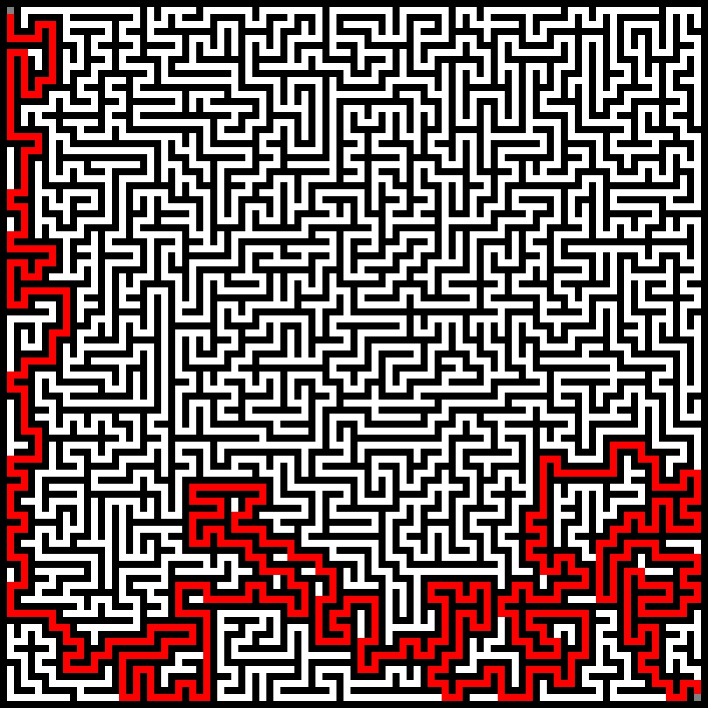

# mazing

 Console app for Maze

## Examples

### Prims with WIDE Printer

    seed : -8741113540676781898
    ##########################################
    ##SS                            ##      ##
    ######  ##################  ##  ##  ######
    ##              ##      ##  ##          ##
    ######  ##  ##  ######  ######  ##########
    ##      ##  ##      ##  ##  ##      ##  ##
    ######  ######  ######  ##  ##########  ##
    ##          ##                          ##
    ##  ##  ##  ######  ##  ######  ##########
    ##  ##  ##      ##  ##      ##          ##
    ######  ######  ##  ######################
    ##      ##  ##  ##                  ##  ##
    ######  ##  ##########  ######  ######  ##
    ##          ##  ##  ##      ##      ##  ##
    ######  ##  ##  ##  ##  ######  ######  ##
    ##      ##          ##  ##              ##
    ##  ##  ##########  ######  ##############
    ##  ##      ##  ##  ##                  ##
    ##  ##  ##  ##  ##########  ##  ######  ##
    ##  ##  ##          ##      ##      ##EE##
    ##########################################

### DFS with DFS solver

 

## Generators ([link](https://en.wikipedia.org/wiki/Maze_generation_algorithm))
 
  - [X] Random Wall placing algorithm
  - [X] DFS
  - [X] Prims
  - [ ] Kruskal's
  - [ ] Wilson's
  - [ ] Aldous-Broder
  - [ ] Recursive division method
  - [ ] Tessellation algorithm
  - [ ] Cellular automaton

## Solvers ([link](https://en.wikipedia.org/wiki/Maze-solving_algorithm))

 - [X] DFS
 - [X] BFS
 - [ ] Tremaux's algorithm
 - [ ] Recursive algorithm
 - [ ] Maze-routing algorithm
 - [ ] A*

## Printers

 - [X] Wide 
 - [X] Box 
 - [ ] Image 
   - [X] PNG
   - [ ] SVG
 - [ ] Animation
   - [ ] GIF
     - [ ] generation & solving
     - [ ] generation
     - [ ] solving

## Author
  
  Maks Makuta (C) 2023  
  MIT Licence
