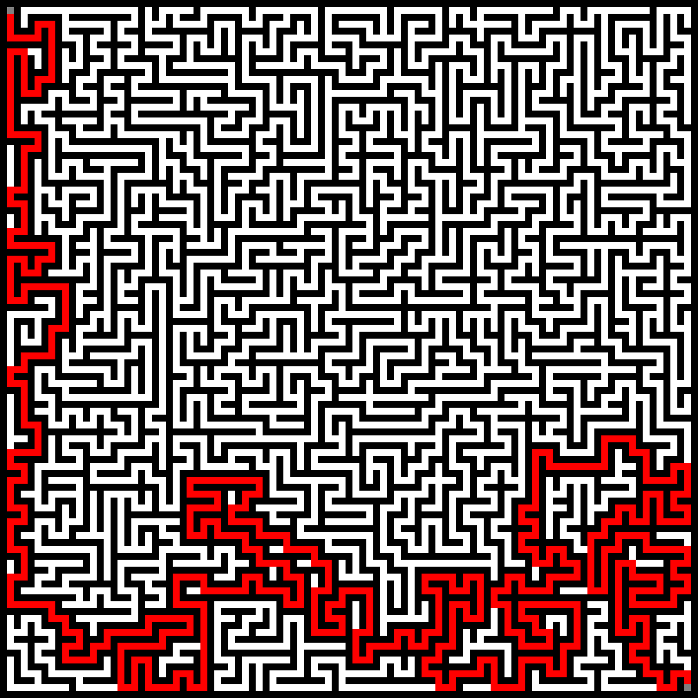

# mazing examples

### Prims with WIDE Printer

    seed : -8741113540676781898
    ##########################################
    ##SS                            ##      ##
    ######  ##################  ##  ##  ######
    ##              ##      ##  ##          ##
    ######  ##  ##  ######  ######  ##########
    ##      ##  ##      ##  ##  ##      ##  ##
    ######  ######  ######  ##  ##########  ##
    ##          ##                          ##
    ##  ##  ##  ######  ##  ######  ##########
    ##  ##  ##      ##  ##      ##          ##
    ######  ######  ##  ######################
    ##      ##  ##  ##                  ##  ##
    ######  ##  ##########  ######  ######  ##
    ##          ##  ##  ##      ##      ##  ##
    ######  ##  ##  ##  ##  ######  ######  ##
    ##      ##          ##  ##              ##
    ##  ##  ##########  ######  ##############
    ##  ##      ##  ##  ##                  ##
    ##  ##  ##  ##  ##########  ##  ######  ##
    ##  ##  ##          ##      ##      ##EE##
    ##########################################

### DFS with DFS solver printed by PNG printer

